# Pi Sensor Dashboard - Architektur Diagramm

Dieses Diagramm zeigt die vollständige Architektur des Pi Sensor Dashboards mit allen Seiten, Komponenten, API-Routen und deren Beziehungen.

```mermaid
---
id: 4ae76f9c-0573-4de5-b391-e262acf6d4b1
---
flowchart TB
    %% Root Layouts
    subgraph ROOT_LAYOUT["📱 Root Layout (app/layout.tsx)"]
        THEME_PROVIDER["ThemeProvider<br/>Dark/Light Mode"]
        INTL_PROVIDER["NextIntlClientProvider<br/>Internationalization"]
        TOASTER["Toaster<br/>Notifications"]
    end

    %% Public Pages & Layouts
    subgraph PUBLIC_PAGES["🌐 Öffentliche Seiten"]
        LOGIN_PAGE["/login/page.tsx<br/>Login Page"]
        SETUP_PAGE["/setup/page.tsx<br/>Setup Wizard"]
        SETUP_LAYOUT["/setup/layout.tsx<br/>Setup Layout"]
        FORGOT_PAGE["/forget-password/page.tsx<br/>Password Reset"]
        RECOVERY_PAGE["/setup/recovery-codes/page.tsx<br/>Recovery Codes"]
    end

    %% Protected Pages & Layouts
    subgraph PROTECTED_PAGES["🔒 Geschützte Seiten"]
        DASHBOARD_LAYOUT["/dashboard/layout.tsx<br/>Protected Layout"]
        DASHBOARD_PAGE["/dashboard/page.tsx<br/>Dashboard Home"]
        TEST_OBJ_PAGE["/dashboard/test-objects/page.tsx<br/>Test Objects Page"]
        TEST_OBJ_TABLE["/dashboard/test-objects/_components/<br/>test-objects-table.tsx"]
        TEST_OBJ_FORM["/dashboard/test-objects/_components/<br/>test-object-form.tsx"]
    end

    %% Form Components
    subgraph FORM_COMPONENTS["📝 Form Komponenten"]
        LOGIN_FORM["components/form/login-form.tsx<br/>@tanstack/react-form + Zod"]
        SETUP_FORM["components/form/setup-form.tsx<br/>Setup Wizard Form"]
        RECOVERY_FORM["components/form/recoverycode-form.tsx<br/>Recovery Code Input"]
        RESET_FORM["components/form/resetpassword-form.tsx<br/>Password Reset Form"]
    end

    %% UI Components & Primitives
    subgraph UI_COMPONENTS["🧩 UI Komponenten"]
        SIDEBAR_SYSTEM["App Sidebar System"]
        NAV_MAIN["app-sidebar/nav-main.tsx"]
        NAV_SECONDARY["app-sidebar/nav-secondary.tsx"]
        APP_NAVBAR["app-navbar.tsx<br/>Header Component"]

        DATA_TABLE_SYSTEM["Data Table System"]
        DATA_TABLE["data-table/data-table.tsx"]
        DATA_TABLE_TOOLBAR["data-table/data-table-toolbar.tsx"]
        DATA_TABLE_PAGINATION["data-table/data-table-pagination.tsx"]
        DATA_TABLE_FILTERS["Data Table Filters<br/>Faceted, Range, Date, Slider"]

        FILE_UPLOAD_SYSTEM["File Upload System"]
        FILE_UPLOAD["ui/file-upload.tsx<br/>Compound Component"]

        EDITABLE_SYSTEM["Editable System"]
        EDITABLE["ui/editable.tsx<br/>Inline Edit Component"]

        UI_PRIMITIVES["UI Primitives (shadcn/ui)"]
        BUTTON["ui/button.tsx"]
        INPUT["ui/input.tsx"]
        CARD["ui/card.tsx"]
        DIALOG["ui/dialog.tsx"]
        SHEET["ui/sheet.tsx"]
        TABLE["ui/table.tsx"]
    end

    %% Theme & Locale Components
    subgraph THEME_LOCALE["🎨 Theme & Locale"]
        SWITCH_THEME["switch-theme.tsx<br/>Theme Toggle"]
        SWITCH_LOCALE["switch-locale.tsx<br/>Language Switcher"]
        LOCALE_SELECT["switch-locale-select.tsx<br/>Select Component"]
        INPUT_PASSWORD["inputGroup-password.tsx<br/>Password Field"]
        BUTTON_LOGOUT["button-logout.tsx<br/>Logout Button"]
    end

    %% Custom Hooks
    subgraph HOOKS["🪝 Custom Hooks"]
        USE_DATA_TABLE["hooks/use-data-table.ts<br/>Table State Management"]
        USE_MOBILE["hooks/use-mobile.ts<br/>Mobile Detection"]
        USE_DEBOUNCED["hooks/use-debounced-callback.ts<br/>Debounced Functions"]
        USE_CALLBACK_REF["hooks/use-callback-ref.ts<br/>Ref Utilities"]
    end

    %% Lib Utilities
    subgraph LIB_UTILS["🛠️ Lib Utilities"]
        PRISMA_CLIENT["lib/prisma.ts<br/>Prisma Singleton"]
        TOKEN_HELPER["lib/token-helper.ts<br/>JWT Management"]
        SETUP_HELPER["lib/setup-helper.ts<br/>Setup Logic"]
        DATA_TABLE_LIB["lib/data-table.ts<br/>Table Utilities"]
        UTILS["lib/utils.ts<br/>General Utils (cn, etc.)"]
        COMPOSE_REFS["lib/compose-refs.ts<br/>Ref Composition"]
        PARSERS["lib/parsers.ts<br/>Data Parsing"]
        FORMAT["lib/format.ts<br/>Formatting Utils"]
        EXPORT["lib/export.ts<br/>Export Utilities"]
        REQUEST_UTILS["lib/request-utils.ts<br/>HTTP Utilities"]
        VALIDATIONS["lib/validations/<br/>Zod Schemas"]
    end

    %% Services
    subgraph SERVICES["🔧 Services"]
        LOCALE_SERVICE["services/locale.ts<br/>Server Actions for Locale"]
    end

    %% i18n System
    subgraph I18N_SYSTEM["🌍 Internationalization"]
        I18N_CONFIG["i18n/config.ts<br/>Locale Configuration"]
        I18N_REQUEST["i18n/request.ts<br/>Request Configuration"]
        MESSAGES_EN["messages/en.json<br/>English Translations"]
        MESSAGES_DE["messages/de.json<br/>German Translations"]
    end

    %% Types
    subgraph TYPE_SYSTEM["📋 Type System"]
        DATA_TABLE_TYPES["types/data-table.ts<br/>Table Type Definitions"]
        INDEX_TYPES["types/index.ts<br/>Global Types"]
        TEST_OBJECT_TYPES["types/test-object.ts<br/>Entity Types"]
    end

    %% Config
    subgraph CONFIG_SYSTEM["⚙️ Configuration"]
        DATA_TABLE_CONFIG["config/data-table.ts<br/>Table Configuration"]
        DATE_FORMAT_CONFIG["config/date-format.ts<br/>Date Formatting"]
        FLAG_CONFIG["config/flag.ts<br/>Feature Flags"]
    end

    %% Authentication APIs
    subgraph AUTH_APIS["🔐 Authentication APIs"]
        LOGIN_API["/api/auth/login/route.ts<br/>POST: User Authentication"]
        REFRESH_API["/api/auth/refresh/route.ts<br/>POST: Token Refresh"]
        RESET_API["/api/auth/reset-password/route.ts<br/>POST: Password Reset"]
        SETUP_API["/api/setup/route.ts<br/>POST: Initial Setup (SSE)"]
        RECOVERY_API["/api/setup/recovery-codes/route.ts<br/>Recovery Codes"]
    end

    %% Resource APIs
    subgraph RESOURCE_APIS["📊 Resource APIs"]
        TEST_OBJECTS_API["/api/test-objects/route.ts<br/>GET/POST: CRUD Operations"]
        TEST_OBJECT_DETAIL["/api/test-objects/[id]/route.ts<br/>GET/PUT/DELETE: Single Item"]

        PICTURES_API["/api/pictures/route.ts<br/>GET/POST: Picture Management"]
        PICTURE_DETAIL["/api/pictures/[id]/route.ts<br/>PATCH/DELETE: Single Picture"]

        DOCUMENTS_API["/api/documents/route.ts<br/>Document Management"]
        DOCUMENT_DETAIL["/api/documents/[id]/route.ts<br/>PATCH/DELETE: Single Doc"]

        LABELS_API["/api/labels/route.ts<br/>GET/POST: Label System"]
        LABEL_DETAIL["/api/labels/[id]/route.ts<br/>PATCH/DELETE: Single Label"]

        UPLOADS_API["/api/uploads/route.ts<br/>POST: File Upload Handler"]
        SETTINGS_API["/api/settings/route.ts<br/>Configuration Management"]
    end

    %% Middleware & Infrastructure
    subgraph MIDDLEWARE_INFRA["�️ Middleware & Infrastructure"]
        AUTH_MIDDLEWARE["middleware.ts<br/>Authentication Guard"]
        PROXY["proxy.ts<br/>Request Proxy"]
        FILE_SYSTEM["File System<br/>public/uploads/ Storage"]
    end

    %% Data Layer
    subgraph DATA_LAYER["💾 Data Layer"]
        PRISMA_ORM["Prisma ORM<br/>Type-safe Database Client"]
        PRISMA_SCHEMA["prisma/schema.prisma<br/>Database Schema"]
        POSTGRES_DB["PostgreSQL Database<br/>Main Data Store"]
        MIGRATIONS["prisma/migrations/<br/>Database Migrations"]
    end

    %% Page Relationships
    LOGIN_PAGE --> LOGIN_FORM
    SETUP_PAGE --> SETUP_FORM
    FORGOT_PAGE --> RECOVERY_FORM
    FORGOT_PAGE --> RESET_FORM
    TEST_OBJ_PAGE --> TEST_OBJ_TABLE
    TEST_OBJ_TABLE --> TEST_OBJ_FORM

    %% Layout Relationships
    ROOT_LAYOUT --> THEME_PROVIDER
    ROOT_LAYOUT --> INTL_PROVIDER
    ROOT_LAYOUT --> TOASTER
    SETUP_LAYOUT --> SWITCH_THEME
    SETUP_LAYOUT --> SWITCH_LOCALE
    DASHBOARD_LAYOUT --> SIDEBAR_SYSTEM
    DASHBOARD_LAYOUT --> APP_NAVBAR

    %% Component System Relationships
    SIDEBAR_SYSTEM --> NAV_MAIN
    SIDEBAR_SYSTEM --> NAV_SECONDARY
    DATA_TABLE_SYSTEM --> DATA_TABLE
    DATA_TABLE_SYSTEM --> DATA_TABLE_TOOLBAR
    DATA_TABLE_SYSTEM --> DATA_TABLE_PAGINATION
    DATA_TABLE_SYSTEM --> DATA_TABLE_FILTERS
    FILE_UPLOAD_SYSTEM --> FILE_UPLOAD
    EDITABLE_SYSTEM --> EDITABLE

    %% Hook Dependencies
    DATA_TABLE --> USE_DATA_TABLE
    SIDEBAR_SYSTEM --> USE_MOBILE
    FORM_COMPONENTS --> USE_DEBOUNCED
    UI_COMPONENTS --> USE_CALLBACK_REF

    %% Form to API Connections
    LOGIN_FORM --> LOGIN_API
    SETUP_FORM --> SETUP_API
    RECOVERY_FORM --> RESET_API
    RESET_FORM --> RESET_API
    TEST_OBJ_FORM --> TEST_OBJECTS_API
    TEST_OBJ_FORM --> UPLOADS_API

    %% Data Table to API Connections
    TEST_OBJ_TABLE --> TEST_OBJECTS_API
    TEST_OBJ_TABLE --> TEST_OBJECT_DETAIL
    DATA_TABLE --> PICTURES_API
    DATA_TABLE --> DOCUMENTS_API

    %% Library Dependencies
    LOGIN_FORM --> TOKEN_HELPER
    SETUP_FORM --> SETUP_HELPER
    DATA_TABLE --> DATA_TABLE_LIB
    TEST_OBJ_FORM --> VALIDATIONS
    UI_COMPONENTS --> UTILS
    EDITABLE --> COMPOSE_REFS

    %% Service Dependencies
    SWITCH_LOCALE --> LOCALE_SERVICE
    I18N_REQUEST --> LOCALE_SERVICE

    %% i18n Dependencies
    FORM_COMPONENTS --> MESSAGES_EN
    FORM_COMPONENTS --> MESSAGES_DE
    UI_COMPONENTS --> I18N_CONFIG
    LOCALE_SERVICE --> I18N_CONFIG

    %% Type Dependencies
    DATA_TABLE --> DATA_TABLE_TYPES
    TEST_OBJ_FORM --> TEST_OBJECT_TYPES
    HOOKS --> INDEX_TYPES

    %% Config Dependencies
    DATA_TABLE --> DATA_TABLE_CONFIG
    UI_COMPONENTS --> DATE_FORMAT_CONFIG
    DATA_TABLE_SYSTEM --> FLAG_CONFIG

    %% API to Infrastructure
    AUTH_APIS --> PRISMA_CLIENT
    RESOURCE_APIS --> PRISMA_CLIENT
    UPLOADS_API --> FILE_SYSTEM
    PICTURES_API --> FILE_SYSTEM
    DOCUMENTS_API --> FILE_SYSTEM

    %% Database Layer
    PRISMA_CLIENT --> PRISMA_ORM
    PRISMA_ORM --> POSTGRES_DB
    PRISMA_SCHEMA --> MIGRATIONS

    %% Middleware Flow
    AUTH_MIDDLEWARE --> TOKEN_HELPER
    AUTH_MIDDLEWARE --> PRISMA_CLIENT
    PROXY --> AUTH_MIDDLEWARE

    %% Theme System
    THEME_PROVIDER --> SWITCH_THEME
    ROOT_LAYOUT --> SWITCH_LOCALE

    %% Cross-cutting Concerns
    UI_PRIMITIVES --> BUTTON
    UI_PRIMITIVES --> INPUT
    UI_PRIMITIVES --> CARD
    UI_PRIMITIVES --> DIALOG
    UI_PRIMITIVES --> SHEET
    UI_PRIMITIVES --> TABLE
```

## Architektur-Übersicht

### Frontend Layer (Next.js 15)

- **Pages**: Alle Seiten der Anwendung (öffentlich und geschützt)
- **Components**: Wiederverwendbare UI-Komponenten
- **Forms**: Spezialisierte Formular-Komponenten

### Backend Layer (API Routes)

- **Auth APIs**: Authentifizierung und Autorisierung
- **Resource APIs**: CRUD-Operationen für alle Datenmodelle

### Data Layer

- **Prisma ORM**: Datenbank-Abstraktionsschicht
- **PostgreSQL**: Hauptdatenbank

### Infrastructure

- **Auth Middleware**: Authentifizierungsprüfung
- **JWT Token Helper**: Token-Management
- **File System**: Upload-Speicherung

### Key Features

- **Polymorphic File System**: Bilder und Dokumente können an beliebige Entitäten angehängt werden
- **Advanced Data Tables**: Mit Filterung, Sortierung, Paginierung
- **Internationalization**: Deutsch/Englisch Support
- **Theme System**: Light/Dark Mode
- **Setup Wizard**: Erstmalige Konfiguration
