# Pi Sensor Dashboard - Architektur Diagramm

Dieses Diagramm zeigt die vollständige Architektur des Pi Sensor Dashboards mit allen Seiten, Komponenten, API-Routen und deren Beziehungen.

```mermaid
---
id: 4ae76f9c-0573-4de5-b391-e262acf6d4b1
---
flowchart TB
    %% Root Layouts
    subgraph ROOT_LAYOUT["📱 Root Layout (app/layout.tsx)"]
        THEME_PROVIDER["ThemeProvider<br/>Dark/Light Mode"]
        INTL_PROVIDER["NextIntlClientProvider<br/>Internationalization"]
        TOASTER["Toaster<br/>Notifications"]
    end

    %% Public Pages & Layouts
    subgraph PUBLIC_PAGES["🌐 Öffentliche Seiten"]
        LOGIN_PAGE["/login/page.tsx<br/>Login Page"]
        SETUP_PAGE["/setup/page.tsx<br/>Setup Wizard"]
        SETUP_LAYOUT["/setup/layout.tsx<br/>Setup Layout"]
        FORGOT_PAGE["/forget-password/page.tsx<br/>Password Reset"]
        RECOVERY_PAGE["/setup/recovery-codes/page.tsx<br/>Recovery Codes"]
    end

    %% Protected Pages & Layouts
    subgraph PROTECTED_PAGES["🔒 Geschützte Seiten"]
        DASHBOARD_LAYOUT["/dashboard/layout.tsx<br/>Protected Layout"]
        DASHBOARD_PAGE["/dashboard/page.tsx<br/>Dashboard Home"]
        TEST_OBJ_PAGE["/dashboard/test-objects/page.tsx<br/>Test Objects Page"]
        TEST_OBJ_TABLE["/dashboard/test-objects/_components/<br/>test-objects-table.tsx"]
        TEST_OBJ_FORM["/dashboard/test-objects/_components/<br/>test-object-form.tsx"]
    end

    %% Form Components
    subgraph FORM_COMPONENTS["📝 Form Komponenten"]
        LOGIN_FORM["components/form/login-form.tsx<br/>@tanstack/react-form + Zod"]
        SETUP_FORM["components/form/setup-form.tsx<br/>Setup Wizard Form"]
        RECOVERY_FORM["components/form/recoverycode-form.tsx<br/>Recovery Code Input"]
        RESET_FORM["components/form/resetpassword-form.tsx<br/>Password Reset Form"]
    end

    %% UI Components & Primitives
    subgraph UI_COMPONENTS["🧩 UI Komponenten"]
        SIDEBAR_SYSTEM["App Sidebar System"]
        NAV_MAIN["app-sidebar/nav-main.tsx"]
        NAV_SECONDARY["app-sidebar/nav-secondary.tsx"]
        APP_NAVBAR["app-navbar.tsx<br/>Header Component"]

        DATA_TABLE_SYSTEM["Data Table System"]
        DATA_TABLE["data-table/data-table.tsx"]
        DATA_TABLE_TOOLBAR["data-table/data-table-toolbar.tsx"]
        DATA_TABLE_PAGINATION["data-table/data-table-pagination.tsx"]
        DATA_TABLE_FILTERS["Data Table Filters<br/>Faceted, Range, Date, Slider"]

        FILE_UPLOAD_SYSTEM["File Upload System"]
        FILE_UPLOAD["ui/file-upload.tsx<br/>Compound Component"]

        EDITABLE_SYSTEM["Editable System"]
        EDITABLE["ui/editable.tsx<br/>Inline Edit Component"]

        UI_PRIMITIVES["UI Primitives (shadcn/ui)"]
        BUTTON["ui/button.tsx"]
        INPUT["ui/input.tsx"]
        CARD["ui/card.tsx"]
        DIALOG["ui/dialog.tsx"]
        SHEET["ui/sheet.tsx"]
        TABLE["ui/table.tsx"]
    end

    %% Theme & Locale Components
    subgraph THEME_LOCALE["🎨 Theme & Locale"]
        SWITCH_THEME["switch-theme.tsx<br/>Theme Toggle"]
        SWITCH_LOCALE["switch-locale.tsx<br/>Language Switcher"]
        LOCALE_SELECT["switch-locale-select.tsx<br/>Select Component"]
        INPUT_PASSWORD["inputGroup-password.tsx<br/>Password Field"]
        BUTTON_LOGOUT["button-logout.tsx<br/>Logout Button"]
    end

    %% Custom Hooks
    subgraph HOOKS["🪝 Custom Hooks"]
        USE_DATA_TABLE["hooks/use-data-table.ts<br/>Table State Management"]
        USE_MOBILE["hooks/use-mobile.ts<br/>Mobile Detection"]
        USE_DEBOUNCED["hooks/use-debounced-callback.ts<br/>Debounced Functions"]
        USE_CALLBACK_REF["hooks/use-callback-ref.ts<br/>Ref Utilities"]
    end

    %% Lib Utilities
    subgraph LIB_UTILS["🛠️ Lib Utilities"]
        PRISMA_CLIENT["lib/prisma.ts<br/>Prisma Singleton"]
        TOKEN_HELPER["lib/token-helper.ts<br/>JWT Management"]
        SETUP_HELPER["lib/setup-helper.ts<br/>Setup Logic"]
        DATA_TABLE_LIB["lib/data-table.ts<br/>Table Utilities"]
        UTILS["lib/utils.ts<br/>General Utils (cn, etc.)"]
        COMPOSE_REFS["lib/compose-refs.ts<br/>Ref Composition"]
        PARSERS["lib/parsers.ts<br/>Data Parsing"]
        FORMAT["lib/format.ts<br/>Formatting Utils"]
        EXPORT["lib/export.ts<br/>Export Utilities"]
        REQUEST_UTILS["lib/request-utils.ts<br/>HTTP Utilities"]
        VALIDATIONS["lib/validations/<br/>Zod Schemas"]
    end

    %% Services
    subgraph SERVICES["🔧 Services"]
        LOCALE_SERVICE["services/locale.ts<br/>Server Actions for Locale"]
    end

    %% i18n System
    subgraph I18N_SYSTEM["🌍 Internationalization"]
        I18N_CONFIG["i18n/config.ts<br/>Locale Configuration"]
        I18N_REQUEST["i18n/request.ts<br/>Request Configuration"]
        MESSAGES_EN["messages/en.json<br/>English Translations"]
        MESSAGES_DE["messages/de.json<br/>German Translations"]
    end

    %% Types
    subgraph TYPE_SYSTEM["📋 Type System"]
        DATA_TABLE_TYPES["types/data-table.ts<br/>Table Type Definitions"]
        INDEX_TYPES["types/index.ts<br/>Global Types"]
        TEST_OBJECT_TYPES["types/test-object.ts<br/>Entity Types"]
    end

    %% Config
    subgraph CONFIG_SYSTEM["⚙️ Configuration"]
        DATA_TABLE_CONFIG["config/data-table.ts<br/>Table Configuration"]
        DATE_FORMAT_CONFIG["config/date-format.ts<br/>Date Formatting"]
        FLAG_CONFIG["config/flag.ts<br/>Feature Flags"]
    end

    %% Authentication APIs
    subgraph AUTH_APIS["🔐 Authentication APIs"]
        LOGIN_API["/api/auth/login/route.ts<br/>POST: User Authentication"]
        REFRESH_API["/api/auth/refresh/route.ts<br/>POST: Token Refresh"]
        RESET_API["/api/auth/reset-password/route.ts<br/>POST: Password Reset"]
        SETUP_API["/api/setup/route.ts<br/>POST: Initial Setup (SSE)"]
        RECOVERY_API["/api/setup/recovery-codes/route.ts<br/>Recovery Codes"]
    end

    %% Resource APIs
    subgraph RESOURCE_APIS["📊 Resource APIs"]
        TEST_OBJECTS_API["/api/test-objects/route.ts<br/>GET/POST: CRUD Operations"]
        TEST_OBJECT_DETAIL["/api/test-objects/[id]/route.ts<br/>GET/PUT/DELETE: Single Item"]

        PICTURES_API["/api/pictures/route.ts<br/>GET/POST: Picture Management"]
        PICTURE_DETAIL["/api/pictures/[id]/route.ts<br/>PATCH/DELETE: Single Picture"]

        DOCUMENTS_API["/api/documents/route.ts<br/>Document Management"]
        DOCUMENT_DETAIL["/api/documents/[id]/route.ts<br/>PATCH/DELETE: Single Doc"]

        LABELS_API["/api/labels/route.ts<br/>GET/POST: Label System"]
        LABEL_DETAIL["/api/labels/[id]/route.ts<br/>PATCH/DELETE: Single Label"]

        UPLOADS_API["/api/uploads/route.ts<br/>POST: File Upload Handler"]
        SETTINGS_API["/api/settings/route.ts<br/>Configuration Management"]
    end

    %% Middleware & Infrastructure
    subgraph MIDDLEWARE_INFRA["�️ Middleware & Infrastructure"]
        AUTH_MIDDLEWARE["middleware.ts<br/>Authentication Guard"]
        PROXY["proxy.ts<br/>Request Proxy"]
        FILE_SYSTEM["File System<br/>public/uploads/ Storage"]
    end

    %% Data Layer
    subgraph DATA_LAYER["💾 Data Layer"]
        PRISMA_ORM["Prisma ORM<br/>Type-safe Database Client"]
        PRISMA_SCHEMA["prisma/schema.prisma<br/>Database Schema"]
        POSTGRES_DB["PostgreSQL Database<br/>Main Data Store"]
        MIGRATIONS["prisma/migrations/<br/>Database Migrations"]
    end

    %% Page Relationships
    LOGIN_PAGE --> LOGIN_FORM
    SETUP_PAGE --> SETUP_FORM
    FORGOT_PAGE --> RECOVERY_FORM
    FORGOT_PAGE --> RESET_FORM
    TEST_OBJ_PAGE --> TEST_OBJ_TABLE
    TEST_OBJ_TABLE --> TEST_OBJ_FORM

    %% Layout Relationships
    ROOT_LAYOUT --> THEME_PROVIDER
    ROOT_LAYOUT --> INTL_PROVIDER
    ROOT_LAYOUT --> TOASTER
    SETUP_LAYOUT --> SWITCH_THEME
    SETUP_LAYOUT --> SWITCH_LOCALE
    DASHBOARD_LAYOUT --> SIDEBAR_SYSTEM
    DASHBOARD_LAYOUT --> APP_NAVBAR

    %% Component System Relationships
    SIDEBAR_SYSTEM --> NAV_MAIN
    SIDEBAR_SYSTEM --> NAV_SECONDARY
    DATA_TABLE_SYSTEM --> DATA_TABLE
    DATA_TABLE_SYSTEM --> DATA_TABLE_TOOLBAR
    DATA_TABLE_SYSTEM --> DATA_TABLE_PAGINATION
    DATA_TABLE_SYSTEM --> DATA_TABLE_FILTERS
    FILE_UPLOAD_SYSTEM --> FILE_UPLOAD
    EDITABLE_SYSTEM --> EDITABLE

    %% Hook Dependencies
    DATA_TABLE --> USE_DATA_TABLE
    SIDEBAR_SYSTEM --> USE_MOBILE
    FORM_COMPONENTS --> USE_DEBOUNCED
    UI_COMPONENTS --> USE_CALLBACK_REF

    %% Form to API Connections
    LOGIN_FORM --> LOGIN_API
    SETUP_FORM --> SETUP_API
    RECOVERY_FORM --> RESET_API
    RESET_FORM --> RESET_API
    TEST_OBJ_FORM --> TEST_OBJECTS_API
    TEST_OBJ_FORM --> UPLOADS_API

    %% Data Table to API Connections
    TEST_OBJ_TABLE --> TEST_OBJECTS_API
    TEST_OBJ_TABLE --> TEST_OBJECT_DETAIL
    DATA_TABLE --> PICTURES_API
    DATA_TABLE --> DOCUMENTS_API

    %% Library Dependencies
    LOGIN_FORM --> TOKEN_HELPER
    SETUP_FORM --> SETUP_HELPER
    DATA_TABLE --> DATA_TABLE_LIB
    TEST_OBJ_FORM --> VALIDATIONS
    UI_COMPONENTS --> UTILS
    EDITABLE --> COMPOSE_REFS

    %% Service Dependencies
    SWITCH_LOCALE --> LOCALE_SERVICE
    I18N_REQUEST --> LOCALE_SERVICE

    %% i18n Dependencies
    FORM_COMPONENTS --> MESSAGES_EN
    FORM_COMPONENTS --> MESSAGES_DE
    UI_COMPONENTS --> I18N_CONFIG
    LOCALE_SERVICE --> I18N_CONFIG

    %% Type Dependencies
    DATA_TABLE --> DATA_TABLE_TYPES
    TEST_OBJ_FORM --> TEST_OBJECT_TYPES
    HOOKS --> INDEX_TYPES

    %% Config Dependencies
    DATA_TABLE --> DATA_TABLE_CONFIG
    UI_COMPONENTS --> DATE_FORMAT_CONFIG
    DATA_TABLE_SYSTEM --> FLAG_CONFIG

    %% API to Infrastructure
    AUTH_APIS --> PRISMA_CLIENT
    RESOURCE_APIS --> PRISMA_CLIENT
    UPLOADS_API --> FILE_SYSTEM
    PICTURES_API --> FILE_SYSTEM
    DOCUMENTS_API --> FILE_SYSTEM

    %% Database Layer
    PRISMA_CLIENT --> PRISMA_ORM
    PRISMA_ORM --> POSTGRES_DB
    PRISMA_SCHEMA --> MIGRATIONS

    %% Middleware Flow
    AUTH_MIDDLEWARE --> TOKEN_HELPER
    AUTH_MIDDLEWARE --> PRISMA_CLIENT
    PROXY --> AUTH_MIDDLEWARE

    %% Theme System
    THEME_PROVIDER --> SWITCH_THEME
    ROOT_LAYOUT --> SWITCH_LOCALE

    %% Cross-cutting Concerns
    UI_PRIMITIVES --> BUTTON
    UI_PRIMITIVES --> INPUT
    UI_PRIMITIVES --> CARD
    UI_PRIMITIVES --> DIALOG
    UI_PRIMITIVES --> SHEET
    UI_PRIMITIVES --> TABLE
```



## Architektur-Übersicht

### Frontend Layer (Next.js 15)

- **Pages**: Alle Seiten der Anwendung (öffentlich und geschützt)
- **Components**: Wiederverwendbare UI-Komponenten
- **Forms**: Spezialisierte Formular-Komponenten

### Backend Layer (API Routes)

- **Auth APIs**: Authentifizierung und Autorisierung
- **Resource APIs**: CRUD-Operationen für alle Datenmodelle

### Data Layer

- **Prisma ORM**: Datenbank-Abstraktionsschicht
- **PostgreSQL**: Hauptdatenbank

### Infrastructure

- **Auth Middleware**: Authentifizierungsprüfung
- **JWT Token Helper**: Token-Management
- **File System**: Upload-Speicherung

### Key Features

- **Polymorphic File System**: Bilder und Dokumente können an beliebige Entitäten angehängt werden
- **Advanced Data Tables**: Mit Filterung, Sortierung, Paginierung
- **Internationalization**: Deutsch/Englisch Support
- **Theme System**: Light/Dark Mode
- **Setup Wizard**: Erstmalige Konfiguration

---

## 🔍 **Detaillierte Komponentenverwendung**

### **Seiten und ihre verwendeten Komponenten:**

#### **app/layout.tsx (Root Layout)**

```tsx
import { Toaster } from '@/components/ui/sonner';
import { ThemeProvider } from '@/components/theme-provider';
// Provider für: NextIntlClientProvider, ThemeProvider, Toaster
```

#### **app/login/page.tsx**

```tsx
import { SwitchTheme } from '@/components/switch-theme';
import LocaleSwitcher from '@/components/switch-locale';
import LoginForm from '@/components/form/login-form';
```

#### **app/setup/layout.tsx**

```tsx
import { SwitchTheme } from '@/components/switch-theme';
import LocaleSwitcher from '@/components/switch-locale';
```

#### **app/setup/page.tsx**

```tsx
import { SetupForm } from '@/components/form/setup-form';
```

#### **app/setup/recovery-codes/page.tsx**

```tsx
import { Button } from '@/components/ui/button';
import { Card, CardContent, CardHeader, CardTitle } from '@/components/ui/card';
```

#### **app/forget-password/page.tsx**

```tsx
import RecoveryCodeForm from '@/components/form/recoverycode-form';
import ResetPasswordForm from '@/components/form/resetpassword-form';
import { SwitchTheme } from '@/components/switch-theme';
import LocaleSwitcher from '@/components/switch-locale';
```

#### **app/dashboard/test-objects/page.tsx**

```tsx
import { DataTableSkeleton } from '@/components/data-table/data-table-skeleton';
import { FeatureFlagsProvider } from '@/components/data-table/feature-flags-provider';
import { TestObjectsTable } from './_components/test-objects-table';
```

### **Form Komponenten und ihre UI-Dependencies:**

#### **components/form/login-form.tsx**

```tsx
// UI Components verwendet:
import { Card, CardContent } from '@/components/ui/card';
import { Button } from '@/components/ui/button';
import { Checkbox } from '@/components/ui/checkbox';
import { Input } from '@/components/ui/input';
import {
  Field,
  FieldDescription,
  FieldGroup,
  FieldLegend,
  FieldLabel,
  FieldError,
  FieldSet,
} from '@/components/ui/field';
import { InputPasswordComponent } from '@/components/inputGroup-password';
import { Label } from '../ui/label';

// External Libraries:
import { useForm } from '@tanstack/react-form';
import { useTranslations } from 'next-intl';
import { toast } from 'sonner';
```

#### **components/form/setup-form.tsx**

```tsx
// UI Components verwendet:
import { Input } from '@/components/ui/input';
import { Button } from '@/components/ui/button';
import { Progress } from '@/components/ui/progress';
import { InputPasswordComponent } from '@/components/inputGroup-password';
import {
  Field,
  FieldDescription,
  FieldError,
  FieldGroup,
  FieldLabel,
  FieldLegend,
  FieldSeparator,
  FieldSet,
} from '@/components/ui/field';

// External Libraries:
import { useForm } from '@tanstack/react-form';
import * as z from 'zod';
```

### **Data Table System - Komponentenhierarchie:**

#### **test-objects-table.tsx (Hauptkomponente)**

```tsx
// Data Table Core:
import { DataTable } from '@/components/data-table/data-table';
import { DataTableToolbar } from '@/components/data-table/data-table-toolbar';
import { DataTableAdvancedToolbar } from '@/components/data-table/data-table-advanced-toolbar';
import { DataTableFilterList } from '@/components/data-table/data-table-filter-list';
import { DataTableSortList } from '@/components/data-table/data-table-sort-list';
import { DataTableFilterMenu } from '@/components/data-table/data-table-filter-menu';

// Hooks:
import { useFeatureFlags } from '@/components/data-table/feature-flags-provider';
import { useDataTable } from '@/hooks/use-data-table';

// Feature Components:
import { getColumns } from './test-objects-table-columns';
import { TestObjectsTableToolbarActions } from './test-objects-table-toolbar-actions';
```

#### **data-table/data-table-toolbar.tsx**

```tsx
// Filter Components:
import { DataTableDateFilter } from '@/components/data-table/data-table-date-filter';
import { DataTableFacetedFilter } from '@/components/data-table/data-table-faceted-filter';
import { DataTableSliderFilter } from '@/components/data-table/data-table-slider-filter';
import { DataTableViewOptions } from '@/components/data-table/data-table-view-options';

// UI Components:
import { Button } from '@/components/ui/button';
import { Input } from '@/components/ui/input';
```

#### **data-table/data-table-faceted-filter.tsx**

```tsx
// UI Components verwendet:
import { Badge } from '@/components/ui/badge';
import { Button } from '@/components/ui/button';
import {
  Command,
  CommandEmpty,
  CommandGroup,
  CommandInput,
  CommandItem,
  CommandList,
  CommandSeparator,
} from '@/components/ui/command';
import {
  Popover,
  PopoverContent,
  PopoverTrigger,
} from '@/components/ui/popover';
import { Separator } from '@/components/ui/separator';
```

### **Sidebar System - Komponentenstruktur:**

#### **app-sidebar/index.tsx**

```tsx
// Navigation Components:
import { NavMain } from './nav-main';
import { NavSecondary } from './nav-secondary';

// UI Components:
import {
  Sidebar,
  SidebarContent,
  SidebarMenu,
  SidebarMenuItem,
  SidebarMenuButton,
  SidebarHeader,
} from '@/components/ui/sidebar';

// Icons (Lucide React):
import {
  ChartSpline,
  Home,
  Settings,
  Search,
  CircleQuestionMark,
  BookOpenText,
  Cable,
  SquareActivity,
  FlaskConical,
} from 'lucide-react';

// i18n:
import { useTranslations } from 'next-intl';
```

### **Test Object Form System:**

#### **test-object-form.tsx**

```tsx
// Form System:
import { zodResolver } from '@hookform/resolvers/zod';
import { useForm } from 'react-hook-form';
import * as z from 'zod';

// UI Components:
import {
  Form,
  FormControl,
  FormField,
  FormItem,
  FormLabel,
  FormMessage,
} from '@/components/ui/form';
import { Input } from '@/components/ui/input';
import { Textarea } from '@/components/ui/textarea';
import {
  Select,
  SelectContent,
  SelectItem,
  SelectTrigger,
  SelectValue,
} from '@/components/ui/select';
import { Button } from '@/components/ui/button';

// File Upload System:
import {
  FileUpload,
  FileUploadDropzone,
  FileUploadList,
  FileUploadItem,
  FileUploadItemPreview,
  FileUploadItemMetadata,
  FileUploadItemDelete,
  FileUploadTrigger,
} from '@/components/ui/file-upload';

// Drag & Drop:
import {
  Sortable,
  SortableContent,
  SortableItem,
  SortableTrigger,
} from '@/components/ui/sortable';

// Editable Components:
import {
  Editable,
  EditableArea,
  EditableInput,
  EditablePreview,
  EditableTrigger,
} from '@/components/ui/editable';
```

### **Specialized Components Dependencies:**

#### **switch-theme.tsx**

```tsx
import { Button } from '@/components/ui/button';
import {
  DropdownMenu,
  DropdownMenuContent,
  DropdownMenuItem,
  DropdownMenuTrigger,
} from '@/components/ui/dropdown-menu';
import { useTheme } from 'next-themes';
```

#### **inputGroup-password.tsx**

```tsx
import { InputGroup, InputGroupAddon, InputGroupInput } from './ui/input-group';
import { Button } from './ui/button';
```

### **File Upload System Hierarchie:**

#### **ui/file-upload.tsx (Compound Component)**

```tsx
// Verwendet verschiedene Icons aus Lucide:
import {
  FileArchiveIcon,
  FileAudioIcon,
  FileCodeIcon,
  FileCogIcon,
  FileIcon,
  FileTextIcon,
  FileVideoIcon,
} from 'lucide-react';

// Internal State Management mit Maps und Refs
// Drag & Drop Funktionalität
// Progress Tracking
// File Type Detection
```

### **Editable System:**

#### **ui/editable.tsx**

```tsx
import { Slot } from '@radix-ui/react-slot';
import { useComposedRefs } from '@/lib/compose-refs';
import { cn } from '@/lib/utils';
import { VisuallyHiddenInput } from '@/components/visually-hidden-input';

// Compound Component Structure:
// - EditableRoot, EditableLabel, EditableArea, EditablePreview
// - EditableInput, EditableTrigger, EditableToolbar
// - EditableCancel, EditableSubmit
```

### **Data Table Filter Components:**

#### **data-table-date-filter.tsx**

```tsx
import { Button } from '@/components/ui/button';
import { Calendar } from '@/components/ui/calendar';
import {
  Popover,
  PopoverContent,
  PopoverTrigger,
} from '@/components/ui/popover';
import {
  Select,
  SelectContent,
  SelectItem,
  SelectTrigger,
  SelectValue,
} from '@/components/ui/select';
import { Separator } from '@/components/ui/separator';
import { formatDate } from '@/lib/format';
```

#### **data-table-slider-filter.tsx**

```tsx
import { Button } from '@/components/ui/button';
import { Input } from '@/components/ui/input';
import { Label } from '@/components/ui/label';
import {
  Popover,
  PopoverContent,
  PopoverTrigger,
} from '@/components/ui/popover';
import {
  Select,
  SelectContent,
  SelectItem,
  SelectTrigger,
  SelectValue,
} from '@/components/ui/select';
import { Separator } from '@/components/ui/separator';
import { Slider } from '@/components/ui/slider';
```

- **Complete Component Dependency Map:**
- **Button**: Verwendet in 15+ Komponenten (meist verwendet)
- **Input**: Verwendet in 10+ Komponenten
- **Card**: Verwendet in 5+ Komponenten
- **Separator**: Verwendet in 8+ Komponenten
- **Badge**: Verwendet in Data Table System
- **Popover**: Verwendet in allen Filter-Komponenten
- **Select**: Verwendet in Forms und Filters
- **Calendar**: Spezifisch für Date Filters
- **Slider**: Spezifisch für Range Filters
- **Checkbox**: Verwendet in Forms und Table Selection
- **Progress**: Spezifisch für Setup Form
- **Skeleton**: Verwendet für Loading States

---

# 📋 **TO-DO Liste - Verbesserungsvorschläge**

## 🚀 **Priorität: HOCH (Sofort)**

### **🔒 Security & Validation**

- [ ] **API Rate Limiting implementieren**
  - `/api/auth/login` - Brute Force Protection
  - `/api/uploads` - File Upload Rate Limits
  - Alle API Endpoints - DDoS Protection
- [ ] **File Upload Security verbessern**
  - File Type Validation auf Server-Seite strengthening
  - File Content Scanning (MIME Type vs. Extension)
  - Virus Scanning Integration
  - File Size Limits per User Role
- [ ] **Input Sanitization**
  - XSS Protection für alle User Inputs
  - SQL Injection Protection (bereits durch Prisma, aber zusätzliche Validierung)
  - Path Traversal Protection für File Operations

### **⚡ Performance Critical**

- [ ] **Database Query Optimization**

  ```typescript
  // Aktuell: N+1 Problem in test-objects queries
  // Fix: Proper includes und select optimization
  ```

  - Prisma Includes statt separater Queries
  - Database Indexing für häufige Queries
  - Query Result Caching implementieren

- [ ] **Image Optimization**

  ```typescript
  // Aktuell: `unoptimized` Images
  // Fix: Next.js Image Component richtig nutzen
  ```

  - Next.js Image Component statt `unoptimized`
  - WebP/AVIF Format Support
  - Lazy Loading für große Bildergalerien
  - Thumbnail Generation

- [ ] **Client-Side Performance**
  - React.memo() für Data Table Components
  - useMemo() für komplexe Filter Calculations
  - Virtualization für große Listen
  - Code Splitting für feature-specific Components

## 🔧 **Priorität: MITTEL (Nächste 2-4 Wochen)**

### **🧪 Testing & Quality Assurance**

- [ ] **Unit Tests implementieren**

  ```bash
  # Setup: Jest + Testing Library
  pnpm add -D @testing-library/react @testing-library/jest-dom jest
  ```

  - Form Validation Tests
  - API Route Tests
  - Component Interaction Tests
  - Custom Hook Tests

- [ ] **E2E Tests mit Playwright**

  ```bash
  pnpm add -D @playwright/test
  ```

  - Login/Setup Flow Tests
  - File Upload Tests
  - Data Table Interaction Tests
  - Multi-language Tests

- [ ] **Error Boundary Implementation**
  ```typescript
  // Für jeden Feature Bereich
  <TestObjectErrorBoundary>
    <TestObjectsTable />
  </TestObjectErrorBoundary>
  ```

### **📊 Monitoring & Observability**

- [ ] **Logging System**

  - Structured Logging mit Winston/Pino
  - Request/Response Logging
  - Error Tracking mit Sentry
  - Performance Monitoring

- [ ] **Analytics & Metrics**
  - User Interaction Tracking
  - Feature Usage Analytics
  - Performance Metrics Dashboard
  - Database Query Performance Monitoring

### **🎨 User Experience**

- [ ] **Loading States verbessern**

  - Skeleton Components für alle Listen
  - Upload Progress Indicators
  - Optimistic Updates für Quick Actions
  - Better Error Messages mit Recovery Actions

- [ ] **Accessibility (a11y)**
  - Keyboard Navigation für Data Tables
  - Screen Reader Support
  - Focus Management
  - ARIA Labels für alle Interactive Elements

## 🌟 **Priorität: NIEDRIG (Langfristig)**

### **🔄 Architecture Improvements**

- [ ] **State Management**

  ```typescript
  // Zustand oder Jotai für Global State
  // Aktuell: Props Drilling in komplexen Components
  ```

  - Global State für User Preferences
  - Optimistic Updates State Management
  - Offline State Synchronization

- [ ] **API Architecture**

  - GraphQL Layer für komplexe Queries
  - API Versioning Strategy
  - OpenAPI/Swagger Documentation
  - WebSocket für Real-time Updates

- [ ] **Micro-Frontends Vorbereitung**
  - Feature-based Code Organization
  - Shared Component Library
  - Independent Deployment Strategy

### **🛠️ Developer Experience**

- [ ] **Documentation**

  ```markdown
  # Fehlende Docs:

  - API Documentation (OpenAPI)
  - Component Storybook
  - Architecture Decision Records (ADRs)
  - Deployment Guide
  ```

- [ ] **Development Tools**
  - Storybook für Component Development
  - MSW (Mock Service Worker) für API Mocking
  - Bundle Analyzer für Performance Insights
  - Automated Code Review Tools

### **🌐 Features & Extensions**

- [ ] **Advanced Features**

  - Bulk Operations für Data Tables
  - Advanced Search mit Elasticsearch
  - Export/Import Functionality
  - Notification System
  - User Preferences Dashboard

- [ ] **Mobile Experience**
  - Progressive Web App (PWA)
  - Mobile-optimierte Data Tables
  - Touch Gestures für File Upload
  - Offline Mode Support

## 🔍 **Code-spezifische TODOs (bereits im Code gefunden)**

### **📅 Date Formatting (config/date-format.ts)**

```typescript
// TODO: Make this configurable per user in settings
// TODO: Implement user preference loading
// TODO: Load from user preferences
```

### **🖼️ Image Optimization (verschiedene Components)**

```typescript
// Fix: Entferne alle `unoptimized` Flags
// Implementiere proper Next.js Image optimization
```

### **🔄 Query Optimization**

```typescript
// test-objects/_lib/queries.ts
// Fix: Client-side filtering → Server-side filtering
// Fix: Separate API calls → Batch requests
```

### **📁 File Upload Error Handling**

```typescript
// components/ui/file-upload.tsx
// Verbessere Error Messages
// Implementiere Retry Logic
// Fix File Validation Edge Cases
```

## 📈 **Implementierungs-Roadmap**

### **Woche 1-2: Security & Performance**

1. API Rate Limiting
2. Image Optimization
3. Query Optimization
4. File Upload Security

### **Woche 3-4: Testing & Monitoring**

1. Unit Tests Setup
2. E2E Tests
3. Error Boundaries
4. Logging System

### **Monat 2: UX & Architecture**

1. Loading States
2. Accessibility
3. State Management
4. API Documentation

### **Monat 3+: Advanced Features**

1. PWA Implementation
2. Advanced Search
3. Notification System
4. Micro-Frontend Preparation

## 🎯 **Success Metrics**

- **Performance**: Lighthouse Score > 90
- **Security**: Zero High/Critical Vulnerabilities
- **Testing**: >80% Code Coverage
- **UX**: <2s Initial Load Time
- **Accessibility**: WCAG 2.1 AA Compliance
- **Developer**: <5min Local Setup Time
